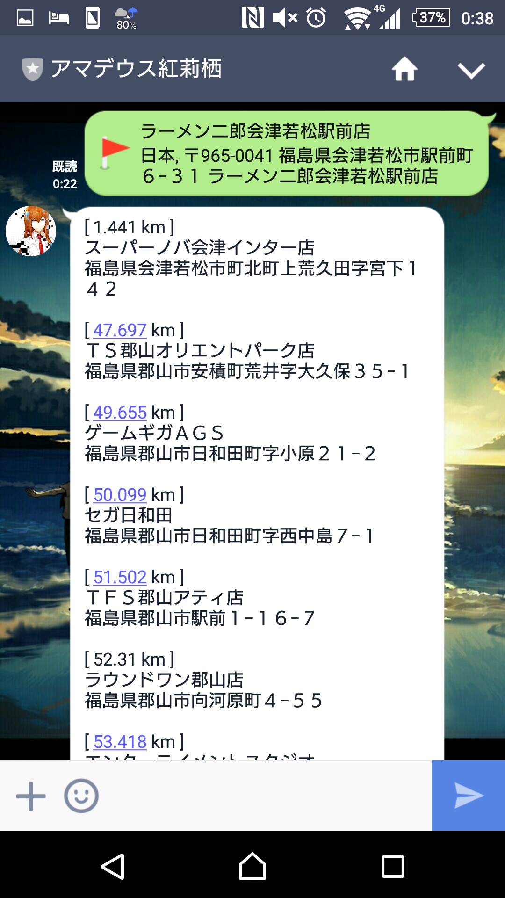

Amadeus Kurisu Makise
====

               .|'''.|     .             ||                       ||'' ...'|||          .
               ||..  '   .||.    ....   ...  .. ...    ....    || |' .|||||.||   ....   .||.     ....
                ''|||.    ||   .|...||   ||   ||  ||  ||. '       |  ||||''''|  '' .||   ||    .|...||
              .     '||   ||   ||        ||   ||  ||  . '|..   || |. '||||  ||  .|' ||   ||    ||
              |'....|'    '|.'  '|...'  .||. .||. ||. |'..|'   |' ||.. ..'. ||  '|..'|'  '|.'   '|.
                                                              '  '''''''''''''
     ============================================================================================================
                            There is no end though there is a start in space. -- Infinity.
             It has own power, it ruins, and it goes though there is a start also in the star. ---Finite.
                    Only the person who was wisdom can read the most foolish one from the history.
    The fish that lives in the sea doesn't know the world in the land. It also ruins and goes if they have wisdom.
                It is funnier that man exceeds the speed of light than fish start living in the land.
               It can be said that this is an final ultimatum from the god to the people who can fight.

## Description
This is a LINE bot of self-satisfaction.  
She is Amadeus Makise Kurisu from STEINS;GATE 0.

She tells us the shortest distance arcade that has Groove Coaster when we send location information.

